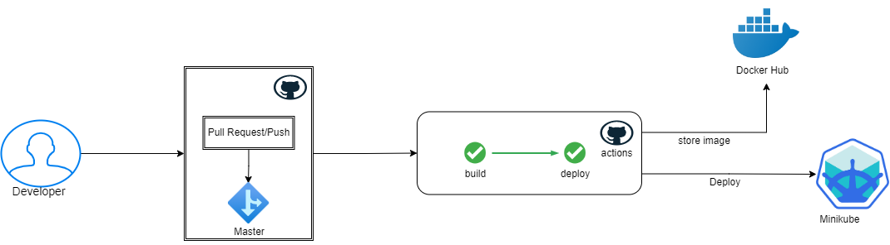

<!-- ABOUT THE PROJECT -->
# About The Project

This is a simple Golang application that serves html files running on a golang server. </br>
The main goal of this project is to learn CI/CD using github action. </br>
So in my project there are 2 main jobs namely: <br>
<ul>
  <li>Build</li>
  <li>Deploy</li>
</ul>

For the CI/CD diagram, we can see in the image that I have made: </br>

  
 <center><figcaption> CI/CD Flow Diagram.</figcaption> <br> </br> </center>

I will explain each steps in this documentation :
<!-- GETTING STARTED -->
All jobs starts when the developer makes a pull request or push into the master branch which will trigger the pipeline and will run automatically. <br>
We can see in this script (<a href=".github/workflows/go-ci.yml">go-ci.yml</a>): <br>

  ```sh
  on:
  push:
    branches: [ master ]
  pull_request:
    branches: [ master ]
  ```
## Buid Jobs (CI process)

Continuous Integration (CI) is the process of merging or integrating code that has been created by a number of development teams into a code repository, to then run pipeline automatically and continuously. <br>

The full Build Jobs we'll see this script: <br>
  ```sh
build:

    runs-on: ubuntu-latest

    steps:
    - uses: actions/checkout@v2
    - name: docker login
      env:
        DOCKER_USER: ${{secrets.DOCKER_USER}}
        DOCKER_PASSWORD: ${{secrets.DOCKER_PASSWORD}}
      run: |
        docker login -u $DOCKER_USER -p $DOCKER_PASSWORD 
    - name: Build the Docker image
      run: docker build . --file Dockerfile --tag daluto/go-cicd:latest
      
    - name: Docker Push
      run: docker push daluto/go-cicd --all-tags
  ```

I'll explain the main script in Build jobs. <br>
In this case, when the pipeline runs it will build golang images using (<a href="Dockerfile">Dockerfile</a>) <br>

- Build images <br>
Script we can see here: 
  ```sh
      - name: Build the Docker image
      run: docker build . --file Dockerfile --tag daluto/go-cicd:latest
  ```
  It will build images from Dockerfile with tag "daluto/go-cicd:latest"

- Docker Login
Before pushing the image to dockerhub, we need to login first to dockerhub. <br>
I make my username and password into variable so that it's not exposed for security reason. <br> 
We can put the scret from (settings/secrets/actions) <br>
The script below: 
  ```sh
  - name: docker login
      env:
        DOCKER_USER: ${{secrets.DOCKER_USER}}
        DOCKER_PASSWORD: ${{secrets.DOCKER_PASSWORD}}
      run: |
        docker login -u $DOCKER_USER -p $DOCKER_PASSWORD 
  ```
- Docker Push <br>
the script to push the images to DockerHub we can see here: <br>
  ```sh
  - name: docker login
        - name: Docker Push
      run: docker push daluto/go-cicd --all-tags 
  ```
That's all for the Build jobs. Now we GO to Deploy stages: 

## Deploy Jobs (CD process)
Continuous Delivery (CD) is an advanced process from CI that prepares code changes to deploy staging or pre-production stages after the build process manually. Code that goes on CD must pass automated unit testing, integration testing, and system testing. <br> <br>

The application should be able to deploy to the kubernetes cluster. But since I don't have a Kubernetes cluster, I will deploy to Minikube which is installed in the github action runner. <br>

Minikube. Like kind , minikube is a tool that allows you to run Kubernetes locally. <br>
The full Deploy Jobs we can see in this script: <br>
  ```sh
  deploy:

    needs : build 

    runs-on: ubuntu-latest

    name: deploy to minikube

    steps:
    - uses: actions/checkout@v2
    - name: Start minikube
      uses: medyagh/setup-minikube@master
    - name: Check the cluster
      run: kubectl get pods -A      
    - name: Deploy to minikube
      run: |
        kubectl apply -f Manifests/ns.yml &&
        kubectl apply -f Manifests/service.yml &&
        kubectl apply -f Manifests/deployment.yml
    - name: Sleep for 30 seconds
      uses: jakejarvis/wait-action@master
      with:
        time: '60s'
    - name: Get Services and pods
      run: |
        kubectl get namespaces &&
        kubectl get svc -n ci-cd &&
        kubectl get pods -n ci-cd 
  ```
  The main script I'll explain : <br>
  - Needs build <br>
  It's mean that Deploy job will not run before build jobs is done.
    ```sh
    needs : build 
    ```
- Start minikube <br>
This script is to install minikube into Github runner. <br>
I uses module action from <a href="https://github.com/medyagh/setup-minikube"> medyagh </a> to install minikube
    ```sh
    uses: medyagh/setup-minikube@master
    ```
- Check the cluster
I use kubectl to check to check if Minikube is running or not.
    ```sh
    - name: Check the cluster
      run: kubectl get pods -A 
    ```
- Deploy to minikube <br>
After minikube is successfully installed, the images that are built but will be deployed to minikube using the manifests that I have provided in the "Manifests" folder.
    ```sh
     - name: Deploy to minikube
      run: |
        kubectl apply -f Manifests/ns.yml &&
        kubectl apply -f Manifests/service.yml &&
        kubectl apply -f Manifests/deployment.yml
    ```
- Sleep for 60 seconds
This script means that the runner will wait until 60s to wait the container running on minikube.
    ```sh
     uses: jakejarvis/wait-action@master
       with:
        time: '60s'
    ```
- Get Services and pods <br>
   This script functions to check and see whether the manifest that we deployed and the container is running successfully or not using kubectl command:
   ```sh
    - name: Get Services and pods
      run: |
        kubectl get namespaces &&
        kubectl get svc -n ci-cd &&
        kubectl get pods -n ci-cd
    ```
     


### Prerequisites

This is an example of how to list things you need to use the software and how to install them.
* npm
  ```sh
  npm install npm@latest -g
  ```

### Installation

_Below is an example of how you can instruct your audience on installing and setting up your app. This template doesn't rely on any external dependencies or services._

1. Get a free API Key at [https://example.com](https://example.com)
2. Clone the repo
   ```sh
   git clone https://github.com/your_username_/Project-Name.git
   ```
3. Install NPM packages
   ```sh
   npm install
   ```
4. Enter your API in `config.js`
   ```js
   const API_KEY = 'ENTER YOUR API';
   ```

<p align="right">(<a href="#readme-top">back to top</a>)</p>


<!-- USAGE EXAMPLES -->
## Demo

To be continued <br>


<!-- CONTACT -->
## Contact

David Calvin - [email] - davidctobing@gmail.com

Project Link: [https://github.com/davidctobing/Go-CI](https://github.com/davidctobing/Go-CI)

LinkedIn - [https://www.linkedin.com/in/davidctobing/](https://www.linkedin.com/in/davidctobing/)


<!-- MARKDOWN LINKS & IMAGES -->
<!-- https://www.markdownguide.org/basic-syntax/#reference-style-links -->
[contributors-shield]: https://img.shields.io/github/contributors/othneildrew/Best-README-Template.svg?style=for-the-badge
[contributors-url]: https://github.com/othneildrew/Best-README-Template/graphs/contributors
[forks-shield]: https://img.shields.io/github/forks/othneildrew/Best-README-Template.svg?style=for-the-badge
[forks-url]: https://github.com/othneildrew/Best-README-Template/network/members
[stars-shield]: https://img.shields.io/github/stars/othneildrew/Best-README-Template.svg?style=for-the-badge
[stars-url]: https://github.com/othneildrew/Best-README-Template/stargazers
[issues-shield]: https://img.shields.io/github/issues/othneildrew/Best-README-Template.svg?style=for-the-badge
[issues-url]: https://github.com/othneildrew/Best-README-Template/issues
[license-shield]: https://img.shields.io/github/license/othneildrew/Best-README-Template.svg?style=for-the-badge
[license-url]: https://github.com/othneildrew/Best-README-Template/blob/master/LICENSE.txt
[linkedin-shield]: https://img.shields.io/badge/-LinkedIn-black.svg?style=for-the-badge&logo=linkedin&colorB=555
[linkedin-url]: https://linkedin.com/in/othneildrew
[product-screenshot]: images/screenshot.png
[Next.js]: https://img.shields.io/badge/next.js-000000?style=for-the-badge&logo=nextdotjs&logoColor=white
[Next-url]: https://nextjs.org/
[React.js]: https://img.shields.io/badge/React-20232A?style=for-the-badge&logo=react&logoColor=61DAFB
[React-url]: https://reactjs.org/
[Vue.js]: https://img.shields.io/badge/Vue.js-35495E?style=for-the-badge&logo=vuedotjs&logoColor=4FC08D
[Vue-url]: https://vuejs.org/
[Angular.io]: https://img.shields.io/badge/Angular-DD0031?style=for-the-badge&logo=angular&logoColor=white
[Angular-url]: https://angular.io/
[Svelte.dev]: https://img.shields.io/badge/Svelte-4A4A55?style=for-the-badge&logo=svelte&logoColor=FF3E00
[Svelte-url]: https://svelte.dev/
[Laravel.com]: https://img.shields.io/badge/Laravel-FF2D20?style=for-the-badge&logo=laravel&logoColor=white
[Laravel-url]: https://laravel.com
[Bootstrap.com]: https://img.shields.io/badge/Bootstrap-563D7C?style=for-the-badge&logo=bootstrap&logoColor=white
[Bootstrap-url]: https://getbootstrap.com
[JQuery.com]: https://img.shields.io/badge/jQuery-0769AD?style=for-the-badge&logo=jquery&logoColor=white
[JQuery-url]: https://jquery.com 